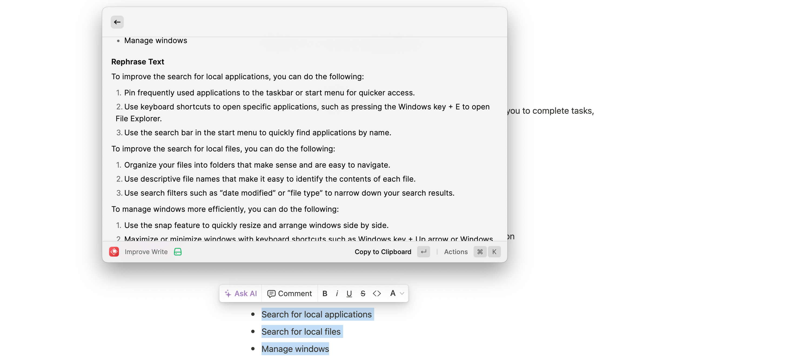
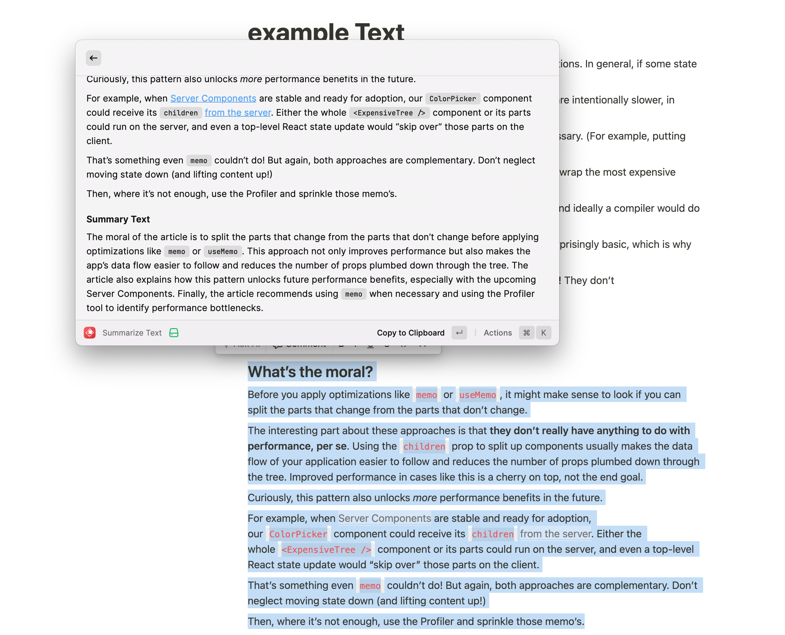
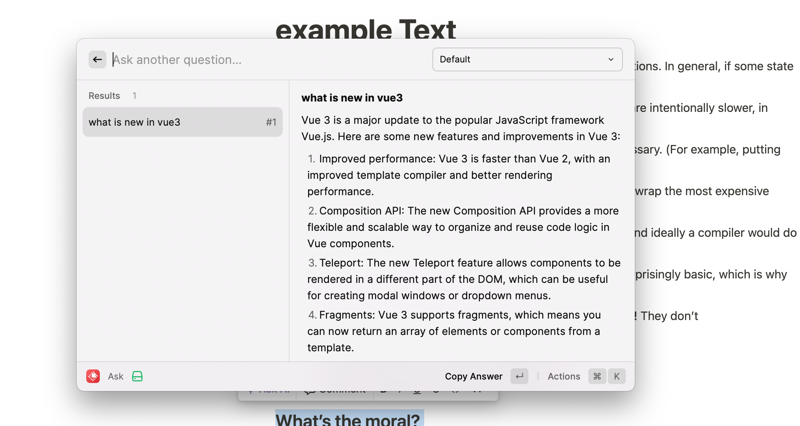

# auto-work

# Motivation

- Clear and concise writing
- Attention to detail
- Creative problem solving
- Collaborative approach to work
- Adaptable and flexible mindset
- Time management and prioritization skills
- Strong work ethic and dedication to meeting deadlines
- Continuous learning and improvement mindset.

# Feature

- Improve write
- Summary text
- Ask question an get answer

# Technical solutions

- Tech stack: react + openai  + @raycast/api  + axios;

# How to use 

- Improve write

- Summary text

- Ask question

